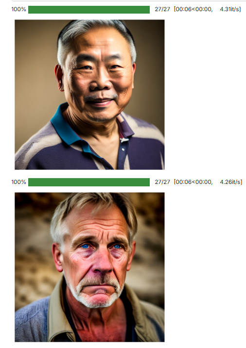

# Synthetic Face Dataset Generation
This project generates a synthetic facial image dataset with different emotions and attributes using Stable Diffusion models, suitable for computer vision and emotion recognition research.

## 🔍 Demo Output



## 🔧 Models Used
- `dreamlike-art/dreamlike-diffusion-1.0`
- `runwayml/stable-diffusion-v1-5`

## 😄 Emotions
- Happy
- Sad
- Angry
- Surprised

## 👤 Variations
- Gender: Male, Female  
- Ethnicity: Latino, White, Black, Middle Eastern, Indian, Asian  
- Age: Young Adult, Middle Aged  
- Camera Angle & Lighting (random)

## ⚙️ Requirements
- Python 3.9+
- CUDA-enabled NVIDIA GPU

## ▶️ Run
Run the notebook cells to generate images.
```bash
pip install --upgrade diffusers[torch]
pip install transformers accelerate
```
📁 Output
Images are saved as:
```
faces/
 ├── happy/
 ├── sad/
 ├── angry/
 └── surprised/
```
A zipped dataset faces.zip is created automatically.

